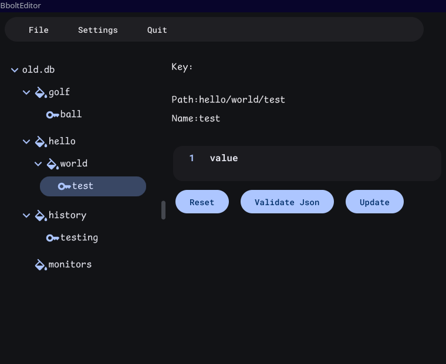

# bboltEditor

bboltEditor is a tool to view and edit [bbolt](https://github.com/etcd-io/bbolt) database files  
bboltEditor is built with [cogentcore](https://www.cogentcore.org/), a cross-platform framework for building powerful, fast, elegant 2D and 3D apps
## Screenshot

## Startup

bboltEditor will open test.db in the current directory or database file passed as command line parameter  
If database file does not exist, it is created  
The main window consists of a toolbar, a tree view of buckets/keys and a details pane

## Toolbar
the toolbar provides buttons to 
* open file selection dialog
* open settings dialog
* open bucket actions menu
* open key actions menu
* quit application

## Database Tree
the left pane displays a tree view of the database  
upon selections, details of the bucket or key will be displayed in details pane.
right clicking on bucket or key name will display a context menu

## Details Pane
### Bucket
displays path and name of bucket
### Key
displays path, name and value of key  
key value is displayed as json if key is valid json or as string otherwise  
key value can be updated directly in details pane

### Bucket Context Menus
* Create Bucket
* Delete Bucket
* Empty Bucket
* Add Key
* Move Bucket
* Rename Bucket
* Copy Bucket

### Key Context Menu
* Delete Key
* Move Key
* Rename Key
* Copy Key

